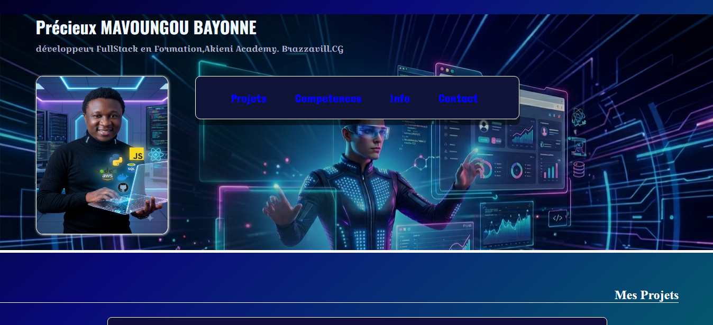

# 🌐 Portfolio — Précieux MAVOUNGOU BAYONNE

> Développeur FullStack en formation @ [Akieni Academy](https://akieni.com) · Brazzaville, République du Congo 🇨🇬

---

## 📸 Aperçu



---

## 📋 Description

Portfolio personnel présentant mon profil, mes projets réalisés et futurs, mes compétences techniques, ainsi qu'un formulaire de contact.  
Projet réalisé dans le cadre du **Mini-Projet Semaine 2** de la Cohort 2 — Akieni Academy (démarrage : juin 2026).

---

## 🗂️ Structure du projet

```
portfolio/
├── index.html        # Page principale (structure sémantique HTML5)
├── style.css         # Feuille de styles (variables CSS, mise en page)
├── img1.png          # Photo de profil
├── image_backg.png   # Image de fond de l'en-tête
├── Capture1.png      # Capture du projet Hero Section
├── Capture2.png      # Capture du projet Card Produit
└── README.md         # Ce fichier
```

---

## 🛠️ Technologies utilisées

| Technologie | Usage |
|---|---|
| `HTML5` | Structure sémantique de la page |
| `CSS3` | Mise en page, variables custom, responsive |
| Google Fonts | Typographies : Oswald, Croissant One, Dancing Script, Concert One |

---

## ✨ Fonctionnalités

- ✅ Navigation interne par ancres (`#projets`, `#competences`, `#info`, `#contact`)
- ✅ Section **Projets** avec cartes d'articles stylisées
- ✅ Section **Compétences** avec liste et citation inspirante
- ✅ Section **Informations** personnelles
- ✅ **Formulaire de contact** (nom, email, téléphone, sujet, message)
- ✅ Design sombre avec palette de couleurs personnalisée via variables CSS
- ✅ Typographie multi-polices cohérente

---

## 🎨 Palette de couleurs

| Variable | Valeur | Rôle |
|---|---|---|
| `--titre` | `#ffffff` | Titres |
| `--texte` | `#b3b3cc` | Texte courant |
| `--bouton` | `#00d4ff` | Boutons & accents bleus |
| `--element` | `#38ef7d` | Accents verts (code, bordures) |
| `--surface` | `#101438` | Fond des surfaces secondaires |
| `--fdcarte` | `#110e3d` | Fond des cartes projets |
| `--bgmain` | `#020024` | Fond principal sombre |

---

## 🚀 Projets présentés

### Réalisés
- **Section Hero + Card Produit E-commerce** — Reproduction fidèle d'une interface inspirée de BlaBlaCar (`HTML`, `CSS`)
- **Portfolio personnel** — Ce projet (`HTML`, `CSS`)

### Futurs projets
- **takeROOM** — Application de réservation de salles (`Next.js`, `Prisma`, `PostgreSQL`, `Tailwind CSS`)
- **MainEvent** — Réseau social dédié aux événements et ventes de tickets

---

## 📦 Installation & utilisation

1. Cloner le dépôt :
   ```bash
   git clone https://github.com/votre-username/portfolio.git
   ```
2. Ouvrir `index.html` dans un navigateur — aucune dépendance requise.

---

## 📬 Contact

- 📧 **Email :** bayonnepre@gmail.com  
- 📍 **Localisation :** Brazzaville, République du Congo  
- 🎓 **Formation :** Akieni Academy — Cohort 2 Fullstack Developer  

---

## 📄 Licence

© 2026 Précieux MAVOUNGOU BAYONNE. Tous droits réservés.
